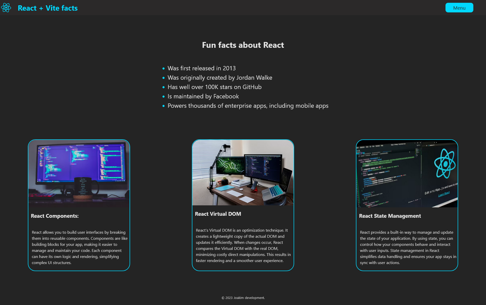
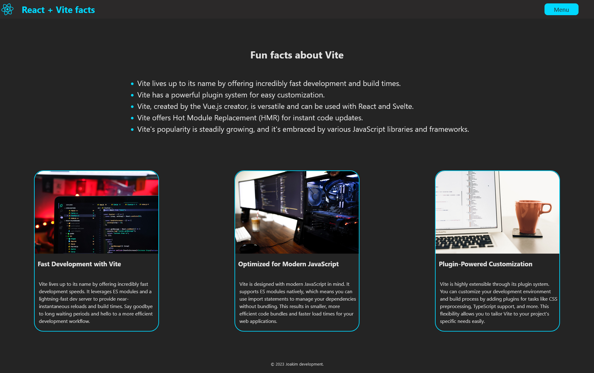

# Project will include the following:

This is a school project with React

1.  Made a Navbar with a dropdown menu to navigate between two pages.
2.  Made a UL list of fun facts that is reusable on both pages.
3.  Made a ProjectCard that includes an image, title and a description. that is also reusable as a component.
4.  Made a base layout that will be used for both pages.

# Screenshots:

